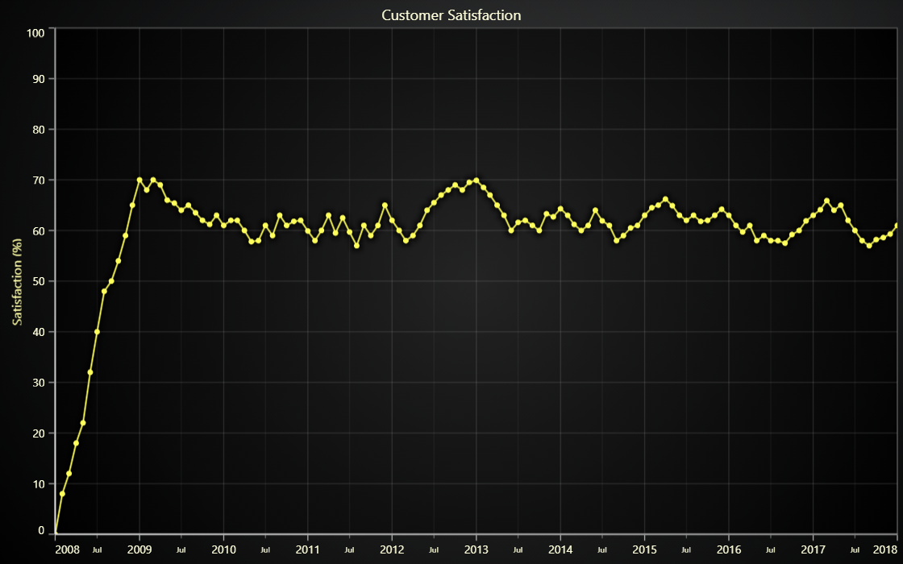

# JavaScript Chart with DateTime Axis



This demo application belongs to the set of examples for LightningChart JS, data visualization library for JavaScript.

LightningChart JS is entirely GPU accelerated and performance optimized charting library for presenting massive amounts of data. It offers an easy way of creating sophisticated and interactive charts and adding them to your website or web application.

The demo can be used as an example or a seed project. Local execution requires the following steps:

-   Make sure that relevant version of [Node.js](https://nodejs.org/en/download/) is installed
-   Open the project folder in a terminal:

          npm install              # fetches dependencies
          npm start                # builds an application and starts the development server

-   The application is available at _http://localhost:8080_ in your browser, webpack-dev-server provides hot reload functionality.


## Description

This example shows creation of a DateTime Axis, for rendering XY-series where either/both of X/Y dimensions can present _time_. This doesn't affect the input of data - format remains as _{x: number, y: number}_ - however, DateTime-axes format their values from number to a date and time. This affects axis labels, markers and cursors.

A DateTime-_Axis_ is created by specifying its _TickStrategy_. Here's how it looks when setting the _Axis TickStrategy_:

```javascript
// Add an XY Chart
const chart = lightningChart().ChartXY({})
// Set the TickStrategy of the default X Axis to a DateTime TickStrategy
chart.getDefaultAxisX().setTickStrategy(AxisTickStrategies.DateTime)
```

The above mentioned examples will provide an Axis that will format its scale values to their DateTime-representations. This conversion relies on a reference date, further referred to as _origin-date_. This _origin-date_ specifies the DateTime value that is equal to _zero_ as a numeric representation. Incremental values will result in progressive DateTimes by milliseconds. For example, given _origin-date_ is equal to the **1st of January 2002, 2PM**, a numeric value of **7,200,000** would be translated to **1st of January 2002 4PM**.

Translating this to how we can modify the origin date in our Axis, we can do this by adding a mutator to the setTickStrategy() method to modify the origin date:

```javascript
// Define the origin-date. (y, m [0-11], d [1-31], h [0-23])
const originDate = new Date(2002, 0, 1, 13)
// Create DateTime AxisTickStrategy with specified originDate.
chart.getDefaultAxisX().setTickStrategy(
    AxisTickStrategies.DateTime,
    // Use a mutator to set the origin date for this Axis' TickStrategy
    (tickStrategy) => tickStrategy.setDateOrigin(originDate),
)
```

If this _TickStrategy_ would be supplied to an _X-Axis_, it would effectively mean that its scale would start from 1st of January 2002 14PM, so a _XY-point_ with coordinates `{ x: 0, y: 0 }` would be formated as `{ x: "1.1.2002 14:00", y: 0 }`.

It is worth mentioning that big _DateTime_-intervals can produce severe precision problems (eq. when zooming in). The only way to battle this is by reducing the distance of timestamps from the active _origin-date_.


## API Links

* [Axis tick strategies]
* [XY cartesian chart]
* [Line series]


## Support

If you notice an error in the example code, please open an issue on [GitHub][0] repository of the entire example.

Official [API documentation][1] can be found on [LightningChart][2] website.

If the docs and other materials do not solve your problem as well as implementation help is needed, ask on [StackOverflow][3] (tagged lightningchart).

If you think you found a bug in the LightningChart JavaScript library, please contact support@lightningchart.com.

Direct developer email support can be purchased through a [Support Plan][4] or by contacting sales@lightningchart.com.

[0]: https://github.com/Arction/
[1]: https://lightningchart.com/lightningchart-js-api-documentation/
[2]: https://lightningchart.com
[3]: https://stackoverflow.com/questions/tagged/lightningchart
[4]: https://lightningchart.com/support-services/

© LightningChart Ltd 2009-2022. All rights reserved.


[Axis tick strategies]: https://lightningchart.com/lightningchart-js-api-documentation/v4.0.0/variables/AxisTickStrategies.html
[XY cartesian chart]: https://lightningchart.com/lightningchart-js-api-documentation/v4.0.0/classes/ChartXY.html
[Line series]: https://lightningchart.com/lightningchart-js-api-documentation/v4.0.0/classes/LineSeries.html

